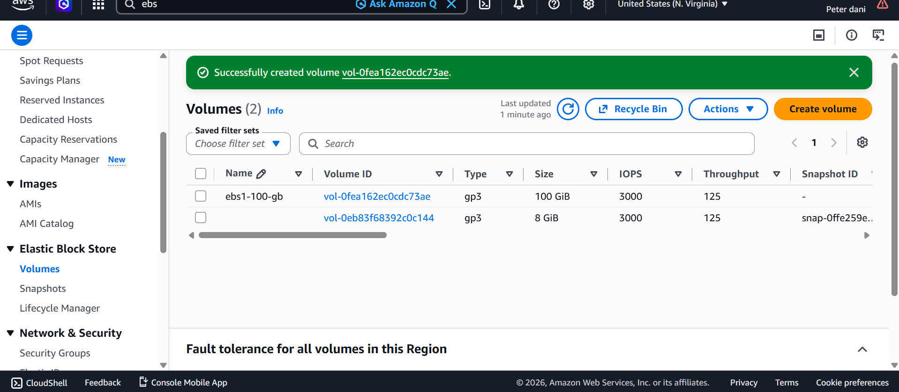
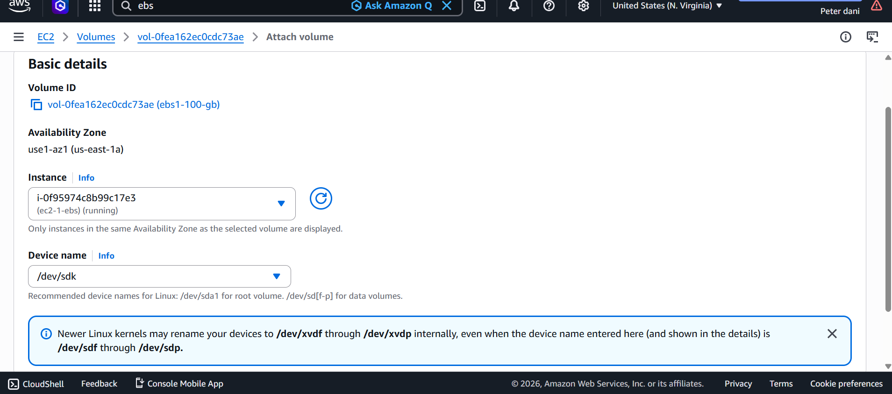
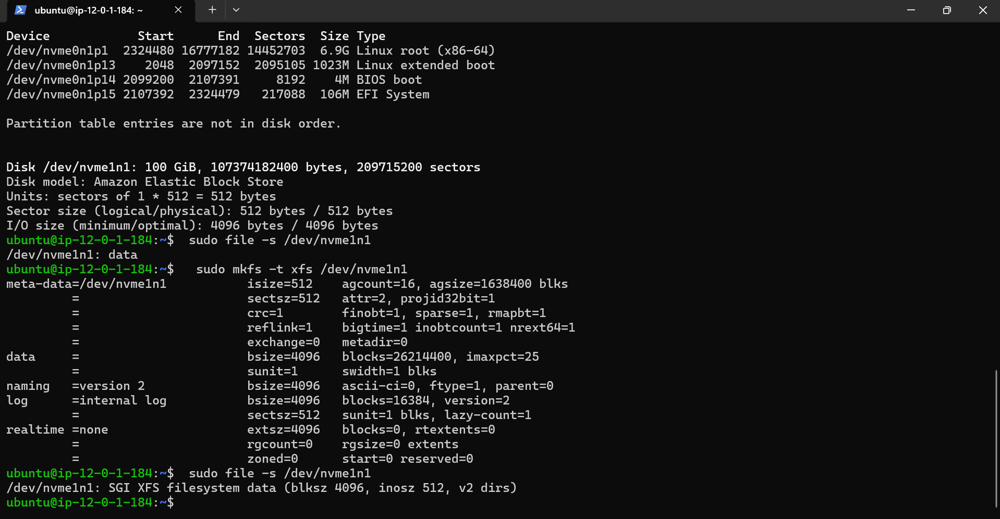
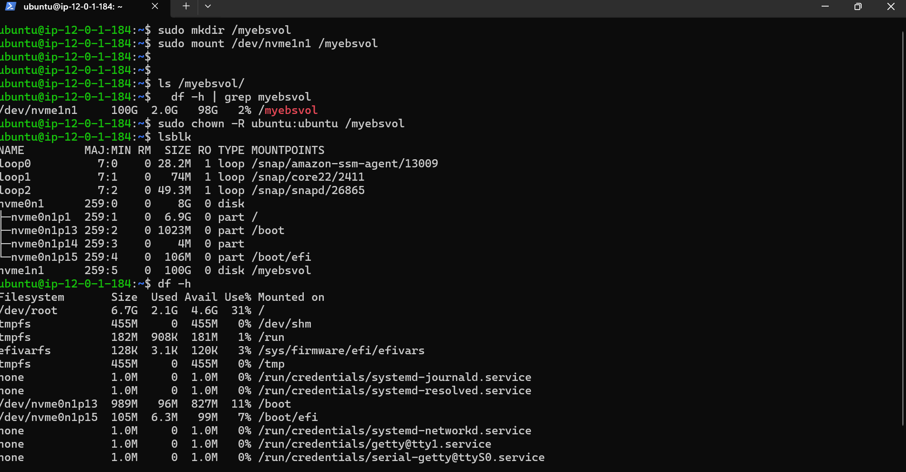
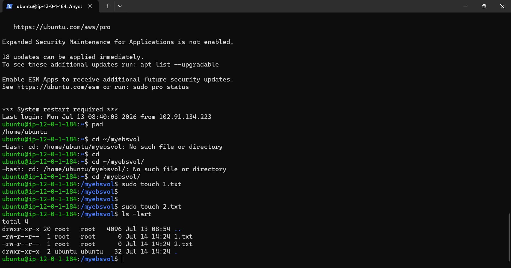
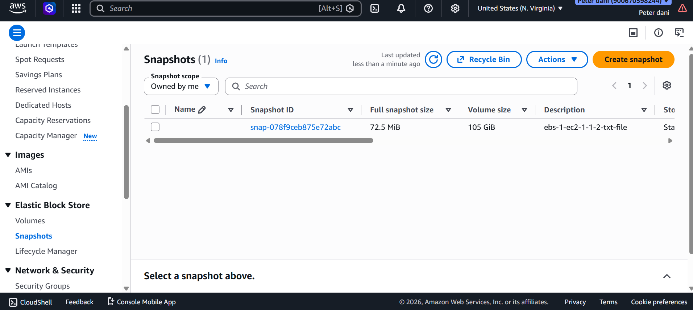
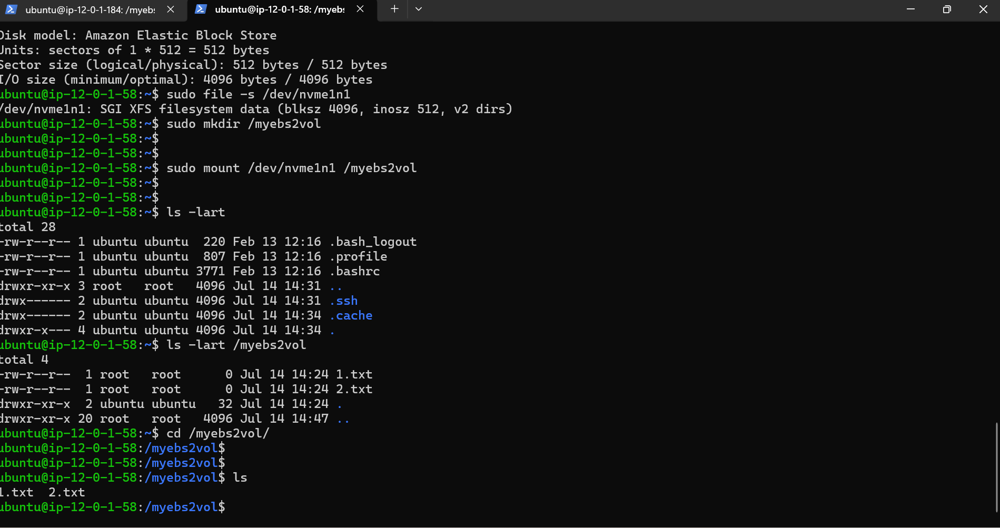

# AWS EBS Lifecycle & Storage Management: Provisioning, Snapshot Restoration, and Dynamic Scaling

A hands-on cloud infrastructure project demonstrating how to manage the complete lifecycle of Amazon Elastic Block Store (EBS) volumes on AWS EC2 Linux instances. This project covers raw block storage initialization, formatting with high-performance XFS filesystems, non-root directory permission management, backup baseline snapshots, verified cross-volume data restoration, and dynamic storage capacity expansion without system downtime.

---

## 🛠️ Skills and Tools Demonstrated
*   *Cloud Infrastructure:* Amazon Web Services (AWS EC2, EBS Volumes, EBS Snapshots, AWS Console).
*   *Linux System Administration:* Block storage management (lsblk, fdisk), filesystem formatting (mkfs.xfs), mount point operations, and user permission management (chown).
*   *Storage Lifecycle Operations:* Creating snapshots, restoring volume backups, and live volume expansion (xfs_growfs).

---

## 📂 Repository Directory Layout
```text
.
├── assets/               # Step-by-step project implementation screenshots
└── README.md             # Project documentation and guide

🚀 Step-by-Step Implementation Guide
Step 1: Provisioning the EBS Block Volume
We began by creating a fresh, high-performance 100 GiB gp3 EBS volume within the same Availability Zone (⁠us-east-1a⁠) as our target host EC2 instance to ensure low-latency block access.
```


Step 2: Attaching the Volume to the EC2 Instance
Once created, the volume was attached to the target Linux instance as a raw block storage device mapped to ⁠/dev/sdk⁠.



Step 3: Initializing and Formatting the Filesystem
After connecting to the instance via SSH, we checked the block devices using ⁠lsblk⁠ and initialized the raw volume with a high-performance XFS filesystem:
# Verify the newly attached device name
lsblk

# Check if the block device has an existing file system
sudo file -s /dev/nvme1n1

# Format the volume using XFS filesystem
sudo mkfs -t xfs /dev/nvme1n1



Step 4: Mounting the Filesystem and Setting Permissions
To make the volume usable by standard applications and users, we created a system mount point, mounted the volume, and altered directory ownership so the standard ⁠ubuntu⁠ user could read/write to the path without requiring root access:
# Create the mount directory
sudo mkdir /myebsvol

# Mount the XFS file system
sudo mount /dev/nvme1n1 /myebsvol

# Verify successful mount and size allocations
df -h | grep myebsvol

# Change directory ownership from root to the standard ubuntu user
sudo chown -R ubuntu:ubuntu /myebsvol



Step 5: Data Creation & Testing Integrity
To verify the read/write capabilities of our newly mounted volume, we created dummy text files to serve as our baseline test data before taking a backup snapshot:
# Create mock test data files
touch /myebsvol/1.txt
touch /myebsvol/2.txt

# Verify files are successfully written
ls -l /myebsvol/




Step 6: Creating an EBS Backup Snapshot
Using the AWS Console, we created a point-in-time snapshot of the active volume. This establishes a read-only backup baseline that preserves our test data.



Step 7: Restoring Data from Snapshot to a New Volume
To test disaster recovery and backup integrity, we generated a brand new EBS volume directly from our snapshot, attached it to our instance, and mounted it to a separate path ⁠/myebs2vol⁠.
Listing the contents of the newly restored mount point proved 100% data integrity, as our original files (⁠1.txt⁠ and ⁠2.txt⁠) were successfully recovered.
# Create second mount point
sudo mkdir /myebs2vol

# Mount the new volume restored from the snapshot
sudo mount /dev/nvme1n1 /myebs2vol

# Verify original files survived the snapshot and restore loop
ls -l /myebs2vol



Step 8: Dynamic EBS Volume Expansion
In a real-world production environment, storage needs can grow over time. We modified the EBS volume size directly in the AWS Console from 100 GiB to 105 GiB and extended the filesystem live on the host instance without unmounting the drive or risking application downtime:
# Grow the XFS filesystem to utilize the newly expanded raw block space
sudo xfs_growfs -d /myebsvol

# Verify that the directory now reflects the upgraded capacity
df -h /myebsvol


🎯 Key Takeaways & Production Best Practices
1. Dynamic Scaling without Outages: Demonstrated the ability to modify storage volumes on the fly in AWS and extend Linux filesystems live without needing to take the server offline or restart running services.
2. Standardized Directory Access Control: Showed the critical step of managing directories with ⁠chown⁠ to hand ownership over to non-root system application users, a core requirement for secure deployment configurations.
3. Robust Backup Integrity: Validated snapshot recovery processes by restoring point-in-time data blocks to secondary devices, ensuring high availability and zero data-loss disaster recovery.
